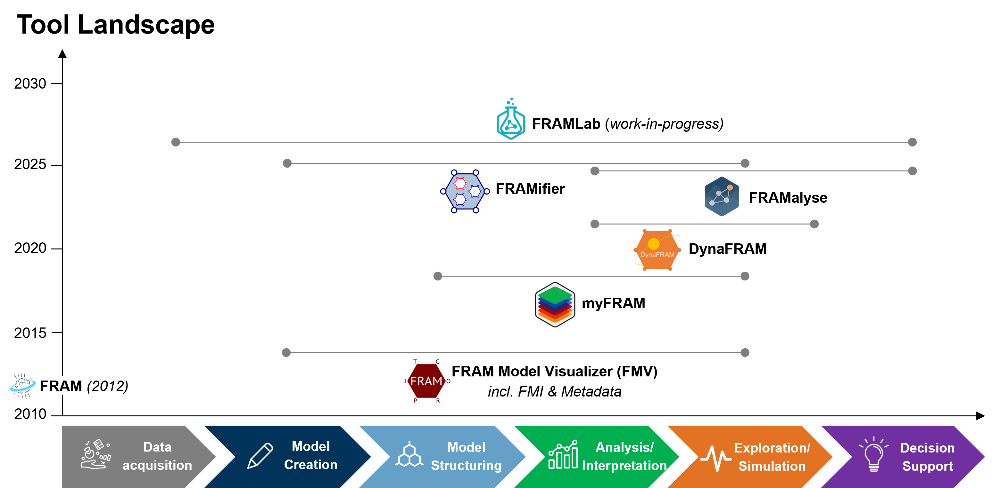

# FRAM Software & Tools

### A community-maintained overview of software supporting the Functional Resonance Analysis Method

This repository provides a structured overview of software, applications, and digital tools related to the **Functional Resonance Analysis Method (FRAM)**.

The purpose of this repository is to help researchers, practitioners, educators, students, and developers:

- Discover available FRAM tools
- Understand the purpose of each tool
- Identify which tool may support a particular modelling task
- Find official access, download, documentation, and support routes
- Compare typical workflows and technical requirements
- Connect software with models, learning materials, and publications
- Make current maintenance and development status visible

The tools presented here cover different stages of the FRAM modelling workflow, including:

1. Data acquisition
2. Model creation
3. Model structuring
4. Analysis and interpretation
5. Exploration and simulation
6. Decision support

  

> This repository is a community catalogue. Unless explicitly stated otherwise, the FRAMily Community does not own, certify, validate, maintain, or provide technical support for the independently developed tools listed here.
> For detailed information about installation, system requirements, supported file formats, licensing, current versions, documentation, tutorials, maintenance status, known limitations, and technical support, please consult the official tool websites, repositories, manuals, and publications linked below.

---

## Quick Tool Overview

| Tool | Main Purpose | Platform / Technical Basis | Access & Documentation | Literature / Citation |
|------|--------------|----------------------------|------------------------|-----------------------|
| **FMV: FRAM Model Visualiser** | Visual model creation, syntactic and consistency checking, cycle-by-cycle interpretation through FMI, and metadata-based quantitative simulation | Progressive Web App; modern browser; offline-installable; Blazor WebAssembly and .NET 8.0 | [Access the FMV Community Edition](https://github.com/functionalresonance/FMV_Community_Edition) · [Read the FMV instructions](https://github.com/functionalresonance/FMV_Community_Edition) | Hill, R., & Hollnagel, E. (2023). *Instructions for use of the FRAM Model Visualiser (FMV).* [View documentation](https://github.com/functionalresonance/FMV_Community_Edition) |
| **myFRAM** | Systematic, tabular, data-driven preparation and analysis of large FRAM models; intended for use in combination with FMV | Microsoft Excel add-in; VBA; Windows and Mac | [Access myFRAM and further information](https://sites.google.com/uniroma1.it/resilienceperspectives/myfram) | Patriarca, R., Di Gravio, G., & Costantino, F. (2017). *myFRAM: An open tool support for the Functional Resonance Analysis Method.* Proceedings of ICSRS 2017, 439–443. [View DOI record](https://doi.org/10.1109/ICSRS.2017.8272861) |
| **DynaFRAM** | Animation and visualisation of scenario instantiations using a FRAM model previously created in FMV | Standalone desktop application; Windows; scenario data prepared as CSV | [Access DynaFRAM, download information, and documentation](https://www.engr.mun.ca/~d.smith/dynafram.html) | Salehi, V., Smith, D., Veitch, B., & Hanson, N. (2021). *A Dynamic Version of the FRAM for Capturing Variability in Complex Operations.* MethodsX, 8, 101333. [View the publication](https://doi.org/10.1016/j.mex.2021.101333) |
| **FRAMalyse** | Structured quantitative analysis and evaluation of an existing FRAM model previously created in FMV | Free standalone desktop application; MATLAB App Designer; Windows 10 or later | [Access FRAMalyse and download information](https://www.mec.ed.tum.de/en/lfe/research/sociotechnical-modeling/software-tool-framalyse/?utm_source=chatgpt.com) | Grabbe, N., & Du, Y. (2025). *FRAMalyse: A supporting open tool to analyse and evaluate the characteristics of models derived by the Functional Resonance Analysis Method.* Proceedings of ESREL & SRA 2025. [View the publication](https://rpsonline.com.sg/proceedings/esrel-sra-e2025/html/ESREL-SRA-E2025-P5512.html) |
| **FRAMifier** | Standalone browser-based model creation, multi-level abstraction, expressions, metadata, and dynamic simulation | HTML, CSS, and JavaScript | [Access FRAMifier, source code, and documentation](https://github.com/pwgbots/framifier) | Bots, P. W. G., & Adriaensen, A. (2025). *Semantical challenges in FRAM while developing the FRAMifier.* 17th FRAMily and 7th International Workshop on Safety-II in Practice. [View DOI record](https://doi.org/10.5281/zenodo.15632732) See also: Bots, P. W. G. (2025). *FRAMifier: A graphical editor and simulation tool in support of the Functional Resonance Analysis Method.* [View the GitHub repository](https://github.com/pwgbots/framifier) |
| **FRAMLab** | Standalone next-generation platform for model creation, dynamic simulation, advanced analytics, what-if analysis, and integration | Browser-based open-source research platform; work in progress; developed at the TUM Chair of Ergonomics | Public GitHub repository in preparation | **Citation forthcoming.** FRAMLab is currently a work-in-progress research platform; a recommended scientific citation has not yet been specified. |

---

## Choosing a Tool

The six tools serve different and partly complementary purposes. They should not be understood as interchangeable versions of the same application.

A key distinction concerns whether a tool can be used as a standalone FRAM modelling environment or whether it processes a model created in another tool.

### Tool Relationships at a Glance

| Tool | Role in the Tool Landscape | Model Creation | Relationship with FMV |
|------|-----------------------------|----------------|-----------------------|
| **FMV** | Established visual modelling, interpretation, and simulation environment | Yes | Core modelling environment |
| **myFRAM** | Tabular preparation, checking, analysis, and reporting for FRAM models | Yes, through structured tabular definition | Designed for use in combination with FMV; documented export to FMV through `.xfmv` |
| **DynaFRAM** | Scenario animation and visualisation | No | Requires a model previously created in FMV |
| **FRAMalyse** | Quantitative structural analysis and model comparison | No | Requires a model previously created in FMV |
| **FRAMifier** | Browser-based modelling and simulation environment | Yes | Standalone alternative modelling environment |
| **FRAMLab** | Next-generation browser-based modelling, simulation, and analytics platform | Yes | Standalone platform built on FMV concepts and intended to remain compatible with existing FMV models |

---

### Start with FMV if you want to:

- Create and edit a visual FRAM model
- Check model syntax and consistency
- Identify orphan functions or missing aspects
- Interpret a model cycle by cycle using FMI
- Add metadata and equations
- Explore scenario instantiations
- Export tables or graphics
- Prepare a model for subsequent use in DynaFRAM or FRAMalyse

FMV can be used as a standalone modelling environment. It also acts as the model-creation basis for DynaFRAM and FRAMalyse.

### Use myFRAM together with FMV if you want to:

- Develop a large model through structured tables
- Work efficiently with 50 or more functions
- Check the completeness of couplings
- Generate network metrics or a Resilience Analysis Matrix
- Prepare and structure model data before graphical modelling in FMV
- Export a tabularly developed model to FMV in .xfmv format

myFRAM is best understood as a tabular and analytical complement to FMV rather than as a replacement for visual modelling.

### Use DynaFRAM after creating a model in FMV if you want to:

- Animate a scenario over an existing FRAM model
- Communicate an instantiation through video
- Create images at selected times in a scenario
- Explore and communicate work-as-done variability
- Control playback speed and display text during an animation
- Compare the progression of different scenario instantiations visually

**Important**: DynaFRAM is not a standalone FRAM model builder. A FRAM model must first be created in FMV and then loaded into DynaFRAM. A separate scenario file, typically prepared in CSV format, is used to control the animation.

### Use FRAMalyse after creating a model in FMV if you want to:

- Analyse and evaluate structural model characteristics quantitatively
- Identify highly connected functions
- Explore critical variability propagation paths
- Calculate and visualise structural complexity indicators
- Compare versions of a FRAM model
- Produce actionable and communication-oriented analytical outputs
- Support a structured interpretation of large-scale models

**Important**: FRAMalyse is not a standalone FRAM model builder. A FRAM model must first be created in FMV and then imported into FRAMalyse for analysis.

### Start with FRAMifier if you want to:

- Work across several abstraction levels
- Use subfunctions and composite functions
- Add variables and expressions as metadata
- Develop verifiable activation logic
- Observe a dynamic model through a simulation monitor

FRAMifier is a standalone browser-based modelling and alternative simulation environment.

### Explore FRAMLab if you want to investigate:

- A browser-based next-generation FRAM environment with enriched comuputation capacity
- Visual model creation and structuring
- Compatibility with existing FMV models
- Time- and cycle-based simulation
- Monte Carlo and sensitivity analysis
- What-if comparison of multiple instantiations
- Real-time visualization by plots & diagrams
- Abstraction/Agency and Space-Time/Agency matrices
- Path visualisation beyond direct couplings
- Real-time exchange with other tools, simulators, or Digital Twin applications
- AI-assisted functionality to support modelling, analysis, interpretation, and exploration

FRAMLab is currently described as a work-in-progress research platform. Features, interfaces, compatibility, documentation, and availability may change during development. A first release is planned for Q4, 2026.
